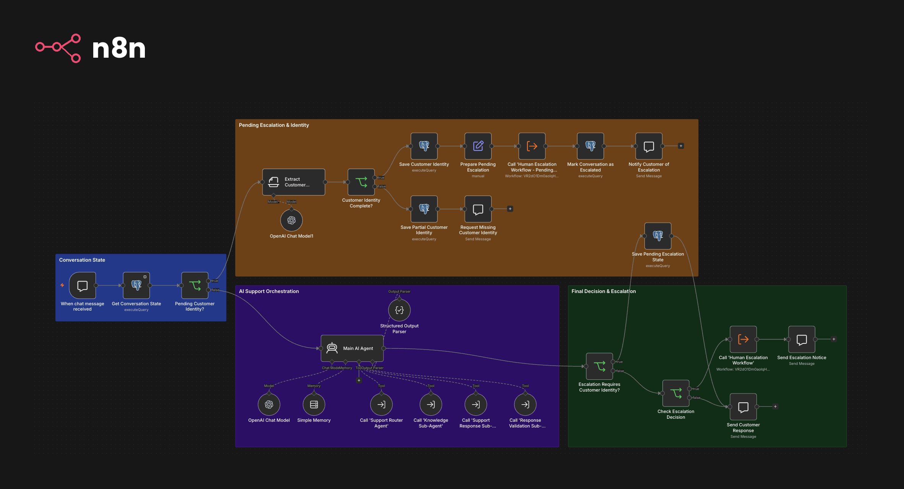
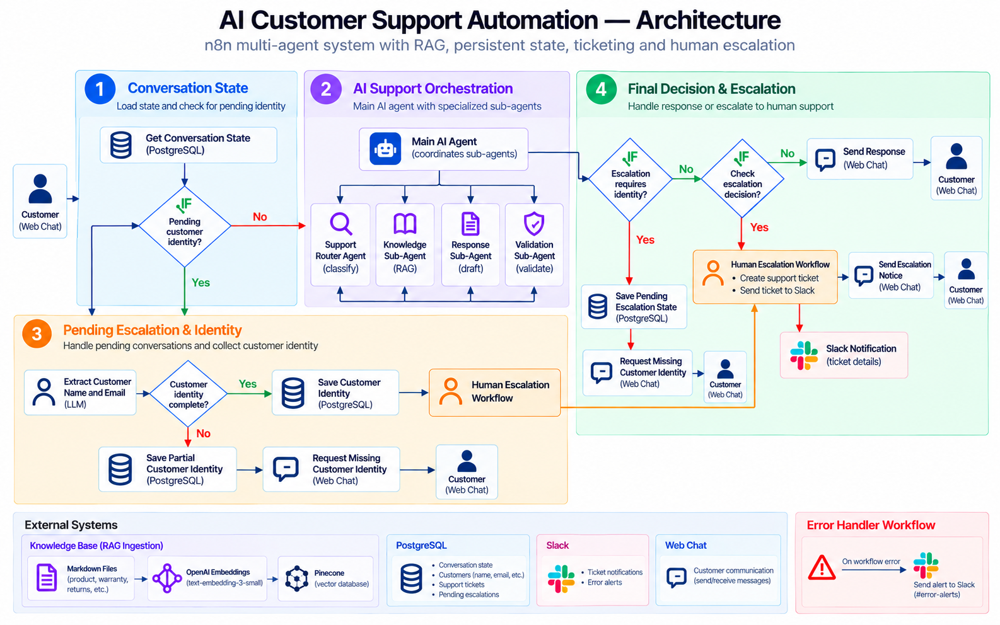

# AI Customer Support Automation — n8n

An **n8n-based multi-agent customer support system** combining Retrieval-Augmented Generation (RAG) with specialized AI agents to classify support requests, retrieve relevant company knowledge, draft and validate responses, manage persistent conversation state, create support tickets, and escalate cases to human support through Slack when necessary.

## Overview



This project explores how specialized AI agents and deterministic workflow automation can work together to handle common customer support requests while preserving human oversight for cases that require intervention.

The system is demonstrated using **Auralis**, a fictional consumer audio company whose knowledge base covers product information, warranty, returns, refunds, shipping, and troubleshooting.

The system is intentionally divided into specialized workflows instead of placing every responsibility in one large agent. The main workflow coordinates AI reasoning and routing; PostgreSQL manages durable application state and ticket records; Pinecone supports knowledge retrieval; and Slack notifies the human support team when a case is escalated.

The core design principle is:

> **Use AI agents for classification and language reasoning, and deterministic workflow/database operations for state changes and business actions.**

## Table of Contents

- [Architecture](#architecture)
- [Support Automation in Action](#support-automation-in-action)
- [Main Workflow](#main-workflow)
- [Support Router Sub-Agent](#support-router-sub-agent)
- [Knowledge Sub-Agent and RAG](#knowledge-sub-agent-and-rag)
- [Support Response Sub-Agent](#support-response-sub-agent)
- [Response Validation Sub-Agent](#response-validation-sub-agent)
- [Persistent Conversation State](#persistent-conversation-state)
- [Human Escalation and Ticketing](#human-escalation-and-ticketing)
- [Global Error Handling](#global-error-handling)
- [End-to-End Flows](#end-to-end-flows)
- [Data Model](#data-model)
- [Tools and Integrations](#tools-and-integrations)
- [AI Models and Retrieval](#ai-models-and-retrieval)
- [Testing and Validation](#testing-and-validation)
- [Token and Workflow Optimization](#token-and-workflow-optimization)
- [Repository Structure](#repository-structure)
- [Configuration](#configuration)
- [Known Limitations and Future Work](#known-limitations-and-future-work)
- [Target Audience](#target-audience)
- [Repository](#repository)
- [Author](#author)
- [Final Note](#final-note)

---

# Architecture

## High-level architecture



The system is organized into four main responsibilities in the Main Workflow:

1. **Conversation State** — checks PostgreSQL for a conversation currently waiting for customer identity.
2. **AI Support Orchestration** — coordinates the router, optional knowledge retrieval, response generation, and response validation.
3. **Pending Escalation & Identity** — collects missing customer identity across messages and resumes the pending escalation when the required information is available.
4. **Final Decision & Escalation** — sends a validated response to the customer or invokes the Human Escalation Workflow.

The Error Handler is a separate workflow shared by the workflows that have error handling configured.

---

# Support Automation in Action

**Auralis** is a fictional audio-products company used to demonstrate the support lifecycle without relying on a real company's private customer data.

Example scenarios include:

- asking about standard shipping;
- asking about warranty or return policies;
- reporting a product issue;
- requesting a replacement;
- explicitly asking for human support;
- providing the customer's name and email in the initial message;
- providing identity details across multiple messages when a case is pending.

The project is designed to illustrate not only response generation, but also state persistence, routing, ticket creation, operational notifications, and error handling.

---

# Main Workflow

The Main Workflow is the orchestration layer. It receives messages through the n8n Chat Trigger, checks durable state, and selects the appropriate route.

## Responsibilities

- Determine whether the incoming message belongs to a pending identity-collection flow.
- Route new requests through the specialized support agents.
- Retrieve Auralis-specific knowledge when needed.
- Keep response generation separate from response validation.
- Respect the final validation decision.
- Persist a case when escalation is required but customer identity is missing.
- Resume the pending escalation without rerunning the full AI pipeline when the customer later supplies the missing details.

## Agent orchestration sequence

For a new support request, the intended sequence is:

```text
Support Router
   ↓
Knowledge Sub-Agent (when required)
   ↓
Support Response Sub-Agent
   ↓
Response Validation Sub-Agent
   ↓
Main Workflow final routing
```

The Main AI Agent coordinates these tools and returns the structured data required by downstream workflow nodes. It does not directly create a ticket or send Slack messages.

## Structured output

The Main AI Agent returns a structured result containing the final decision and the fields needed by downstream workflows, including:

- `decision` — `send` or `escalate`;
- `customer_response` — the message to show the customer;
- `proposed_response` — the response proposed by the Support Response Sub-Agent;
- `validation_reason` — the validator's reason;
- `customer_request` and `original_customer_request`;
- `conversation_context`;
- `router_result` and `response_metadata`;
- `customer_name` and `customer_email`.

The original support request is preserved when the customer sends later messages containing only identity information.

---

# Support Router Sub-Agent

The Support Router is the first specialized agent used for a new support request. It classifies and structures the request so that downstream steps can make consistent routing decisions.

## Responsibilities

- Identify the customer's intent and request category.
- Assign a priority.
- Determine whether customer information is required.
- Decide whether the knowledge base should be consulted.
- Identify signals that human intervention may be required.
- Return a structured classification for the Main AI Agent and downstream workflows.

The router is a classification component. It does not create tickets or communicate with the customer directly.

---

# Knowledge Sub-Agent and RAG

The Knowledge Sub-Agent is responsible for retrieving company-specific information from the Auralis knowledge base. It is used when a response needs reliable evidence from company documentation.

## Retrieval pipeline

The knowledge ingestion workflow reads the Markdown knowledge documents from Google Drive, splits the text into chunks, creates embeddings, and indexes the chunks in Pinecone. At runtime, the Knowledge Sub-Agent retrieves relevant excerpts for the current support question.

```text
Google Drive knowledge documents
          ↓
       Text split
          ↓
       Embeddings
          ↓
    Pinecone index
          ↓
Knowledge Sub-Agent retrieval
          ↓
 Relevant excerpts and sources
```

## Grounding rules

- Use retrieved documentation as the source of truth for Auralis-specific policy and product claims.
- Do not invent warranty terms, refund rules, eligibility, product features, or procedures.
- When the retrieved material does not support a claim, the system should acknowledge that the information could not be verified rather than fill the gap with a guess.
- The Knowledge Sub-Agent retrieves evidence; the Support Response Sub-Agent uses that evidence to draft a response.

The fictional knowledge base includes information about product support, warranty coverage, returns, refunds, shipping, and Auralis audio products.

---

# Support Response Sub-Agent

The Support Response Sub-Agent drafts the proposed customer-facing response after routing and any required knowledge retrieval.

## Inputs

- The customer request.
- The Support Router result.
- Relevant knowledge retrieval results, when applicable.
- Relevant conversation context.

## Outputs

The agent returns a proposed response and metadata indicating whether additional information is needed and whether human intervention is required.

It does not perform knowledge retrieval itself, validate its own answer as the final authority, create support tickets, or send the final message directly to the customer.

---

# Response Validation Sub-Agent

The Response Validation Sub-Agent is the quality-control stage before a response is sent to the customer.

It receives the customer request, router result, knowledge results, proposed response, response metadata, and relevant conversation context.

Its result includes:

- `is_valid` — whether the proposed response meets the validation criteria;
- `decision` — whether to `send` or `escalate`;
- `reason` — the reason behind the decision.

The Main Workflow treats this as the final validation decision. A response is sent only when the decision permits it; an escalation decision or invalid response is routed to human support instead of sending the proposed answer as if it were approved.

---

# Persistent Conversation State

PostgreSQL stores pending escalation state when customer identity is missing. **The workflow collects the customer's name and email across multiple messages, preserving previously supplied information until both fields are available.**

Once identity is complete, the workflow resumes escalation, creates a support ticket, and notifies the human support team through Slack without rerunning the full AI pipeline.

This explicit state management keeps business workflow decisions separate from LLM conversational memory.

---

# Human Escalation and Ticketing

The Human Escalation Workflow is a separate workflow invoked by the Main Workflow when a case needs human intervention and the identity requirement has been satisfied.

## Processing sequence

```text
When Executed by Another Workflow
          ↓
Find/Create Customer (PostgreSQL)
          ↓
Create Support Ticket (PostgreSQL)
          ↓
Build Escalation Message
          ↓
Send Escalation Message to Slack
          ↓
Return Ticket Data
```

## Customer reuse

Customers are matched by email. The workflow uses PostgreSQL `INSERT ... ON CONFLICT (email)` so the same email can reuse the existing customer record instead of creating a duplicate customer.

## Ticket numbering

Support tickets receive identifiers such as `AUR-0001`, generated using a PostgreSQL sequence. Each new escalation creates a support ticket with fields such as:

- customer ID;
- original customer request;
- category and priority;
- proposed response;
- validation reason;
- status and creation timestamp.

The ticket is stored in PostgreSQL, while the Slack notification gives the human support team the information needed to review the case. The customer then receives a confirmation message containing the ticket number and the email address to be used for follow-up.

## Two supported escalation paths

**Identity already available:** the ticket is created directly after the final support decision.

**Identity missing:** the workflow persists the pending case and asks the customer for identity information. When the customer provides the missing details in a later message, the pending branch resumes the escalation without rerunning the Main AI Agent.

---

# Global Error Handling

The Error Handler Workflow centralizes operational alerts for workflows configured to use it.

## Processing sequence

```text
Workflow execution error
          ↓
      Error Trigger
          ↓
   Build Error Context
          ↓
   Send Error Alert to Slack
```

The alert context includes the workflow name, failed node, error message, and execution ID. The execution ID helps locate the specific failed run in n8n.

The Error Handler is separate from normal support processing: its purpose is to notify the operator about execution failures, not to answer customers or retry the failed business action automatically.

---

# End-to-End Flows

## Flow 1 — Normal support question

Example:

> How long does standard shipping take?

```text
When chat message received
   ↓
Get Conversation State
   ↓
Pending Customer Identity? → No
   ↓
Main AI Agent
   ↓
Router → Knowledge (when required) → Response → Validation
   ↓
Final Support Decision = send
   ↓
Send Customer Response
```

No support ticket or pending identity record is required for an ordinary question.

## Flow 2 — Direct escalation with identity

Example:

> My headphones are still not working and I want human support. My name is John Smith and my email is johnsmith@example.com.

```text
When chat message received
   ↓
Get Conversation State
   ↓
Pending Customer Identity? — No
   ↓
Main AI Agent
   ↓
Router → Knowledge (when required) → Response → Validation
   ↓
Escalation Requires Customer Identity? — No
   ↓
Check Escalation Decision? — Escalate
   ↓
Call 'Human Escalation Workflow'
   ↓
Find/Create Customer → Create Support Ticket → Slack Notification
   ↓
Send Escalation Notice
```

The workflow does not need to create an `awaiting_customer_identity` record because there is no missing identity information to collect.

## Flow 3 — Escalation with missing identity

Example:

> My headphones are still not working and I want human support.

```text
When chat message received
   ↓
Get Conversation State
   ↓
Pending Customer Identity? — No
   ↓
Main AI Agent
   ↓
Router → Knowledge (when required) → Response → Validation
   ↓
Escalation Requires Customer Identity? — Yes
   ↓
Save Pending Escalation State
   ↓
Send Customer Response — Request name and email
```

No support ticket is created at this stage. The workflow saves the pending escalation state and asks the customer for their name and email before proceeding with the escalation.

## Flow 4 — Identity supplied across messages

Example:

> **Message 1:** My name is John Smith.

```text
Customer provides name
   ↓
When chat message received
   ↓
Get Conversation State
   ↓
Pending Customer Identity? — Yes
   ↓
Extract Customer Identity
   ↓
Customer Identity Complete? — No
   ↓
Save Partial Customer Identity
   ↓
Request Missing Customer Identity — Email
```

> **Message 2:** My email is johnsmith@example.com.

```text
Customer provides email
↓
When chat message received
↓
Get Conversation State
↓
Pending Customer Identity? — Yes
↓
Extract Customer Identity
↓
Customer Identity Complete? — Yes
↓
Save Customer Identity
↓
Prepare Pending Escalation
↓
Call 'Human Escalation Workflow - Pending Case'
↓
Mark Conversation as Escalated
↓
Notify Customer of Escalation
```

The workflow collects the customer's identity across separate messages, preserving the name provided in the first message. When the customer supplies their email, the workflow combines both details, resumes the pending escalation, creates the support ticket, notifies the human support team through Slack, and confirms the escalation to the customer.

## Flow 5 — New question after escalation

After the pending conversation is marked `escalated`, a later message such as “How long does standard shipping take?” is treated as a normal support request. It does not reopen the pending identity flow.

---

# Data Model

The system uses PostgreSQL (through Supabase in the current setup) for durable customer, ticket, and pending-conversation data.

## `customers`

Stores customer identity and supports deduplication by email.

| Column       | Purpose                      |
| ------------ | ---------------------------- |
| `id`         | Internal customer identifier |
| `name`       | Customer name                |
| `email`      | Unique customer email        |
| `created_at` | Record creation timestamp    |

## `support_tickets`

Stores each human-support ticket.

| Column                     | Purpose                                    |
| -------------------------- | ------------------------------------------ |
| `id`                       | Internal ticket identifier                 |
| `ticket_number`            | Public identifier, for example `AUR-0001`  |
| `customer_id`              | Reference to `customers.id`                |
| `customer_request`         | Original support request                   |
| `category`                 | Router category                            |
| `priority`                 | Router priority                            |
| `proposed_response`        | Proposed response retained for review      |
| `validation_reason`        | Reason for validation/escalation           |
| `status`                   | Ticket status, currently created as `open` |
| `created_at`, `updated_at` | Timestamps                                 |

## `support_conversations`

Stores persistent conversation state for workflows that need to continue across multiple messages, particularly when customer identity is missing during an escalation.

| Column                      | Purpose                                                                                          |
| --------------------------- | ------------------------------------------------------------------------------------------------ |
| `id`                        | Internal conversation identifier                                                                 |
| `session_id`                | Chat session key; unique per stored conversation state                                           |
| `customer_id`               | Reference to the associated customer                                                             |
| `status`                    | Current workflow state, such as `active`, `awaiting_customer_identity`, `escalated`, or `closed` |
| `pending_action`            | Action to resume, currently used for ticket creation                                             |
| `original_customer_request` | Original request that initiated the support case                                                 |
| `category`                  | Support category preserved for escalation                                                        |
| `priority`                  | Priority level preserved for escalation                                                          |
| `proposed_response`         | Proposed response preserved for the support case                                                 |
| `validation_reason`         | Validation context preserved for the ticket                                                      |
| `conversation_context`      | Relevant conversation context available at escalation time                                       |
| `customer_name`             | Customer name collected across messages                                                          |
| `customer_email`            | Customer email collected across messages                                                         |
| `active_ticket_id`          | Optional reference to the associated support ticket                                              |
| `created_at`                | Timestamp when the record was created                                                            |
| `updated_at`                | Timestamp when the record was last updated                                                       |

The current implementation does **not** store every chat message in a separate `conversation_messages` table. The pending-state table is for resumable workflow state, not a full audit transcript.

---

# Tools and Integrations

| Technology                                       | Purpose                                                                               |
| ------------------------------------------------ | ------------------------------------------------------------------------------------- |
| **n8n**                                          | Workflow orchestration, agent tools, branching, and integrations                      |
| **OpenAI Chat Models**                           | Classification, orchestration, response drafting, validation, and identity extraction |
| **OpenAI Embeddings (`text-embedding-3-small`)** | Convert knowledge chunks into vectors for retrieval                                   |
| **Pinecone**                                     | Vector storage and similarity retrieval for the Auralis knowledge base                |
| **Google Drive**                                 | Source for Markdown knowledge documents used by ingestion                             |
| **PostgreSQL / Supabase**                        | Persistent conversation state, customer records, and support tickets                  |
| **Slack**                                        | Human escalation notifications and operational error alerts                           |

The exact credentials and linked workflow IDs must be configured in the target n8n instance after importing the sanitized exports.

---

# AI Models and Retrieval

The Main Workflow currently uses an OpenAI chat model configured as `gpt-5.6-luna`; the identity-extraction model is configured with low reasoning effort. Other agent workflows can have their own model settings.

The knowledge ingestion workflow uses `text-embedding-3-small` to embed document chunks before storing them in Pinecone.

Model configuration is kept in workflow nodes rather than in this README so the workflow exports remain the source of truth. Model availability and configuration may change as the project evolves.

---

# Testing and Validation

The main customer-support and escalation paths have been tested through the n8n chat workflow and verified against PostgreSQL records and Slack messages.

| Scenario                                | Expected result                                               | Status |
| --------------------------------------- | ------------------------------------------------------------- | ------ |
| Normal shipping question                | Normal support response; no pending escalation record         | Passed |
| Escalation with name and email included | Ticket created directly and Slack notified                    | Passed |
| Escalation without identity             | `awaiting_customer_identity` persisted; no ticket created yet | Passed |
| Customer provides only a name           | Name persisted; system asks only for email                    | Passed |
| Customer later provides only an email   | Stored name and new email combined; ticket created            | Passed |
| New question after escalation           | Pending-state branch skipped; normal support flow resumes     | Passed |
| Existing customer escalates again       | Existing customer reused by email; new ticket created         | Passed |

These are functional validation scenarios, not a formal load, security, or reliability test suite.

---

# Token and Workflow Optimization

A core engineering goal is to keep the multi-agent system reliable without paying for unnecessary model calls or sending excessive context between agents.

The pending-state path already avoids rerunning the complete Main AI Agent when a message only supplies missing identity data. That is an intentional workflow-level optimization.

> **Token optimization is an ongoing process, with the workflow continuously evolving to reduce token usage.**

The goal is to reduce token use while preserving grounding, customer-data accuracy, validation quality, and escalation behavior.

---

# Repository Structure

```text
ai_customer_support_automation/
├── README.md
├── .gitignore
├── database/
│   └── table_schema.sql
├── screenshots/
├── knowledge-base/
└── workflows/
    ├── errorHandler/
    │   └── error_handler_workflow.json
    ├── humanEscalation/
    │   └── human_escalation_workflow.json
    ├── knowledge_Ingestion/
    │   └── knowledge_ingestion_workflow.json
    ├── knowledge_sub_agent/
    │   └── knowledge_sub_agent.json
    ├── main/
    │   └── main_workflow.json
    ├── responseValidation/
    │   └── response_validation_sub_agent.json
    ├── supportResponse/
    │   └── support_response_sub_agent.json
    └── supportRouter/
        └── support_router_sub_agent.json
```

---

# Configuration

The public workflow exports are sanitized templates. Before running them in another n8n instance, configure the integrations and restore the linked workflow references.

## 1. n8n

- Import the workflow JSON files into your n8n instance.
- Configure the required node types and integrations.
- Replace all workflow ID placeholders with the IDs of the matching imported sub-workflows.
- Configure the Error Workflow reference for workflows that should use centralized error handling.
- Publish or activate the workflows as appropriate for their triggers.

## 2. OpenAI

Create/select an OpenAI credential for the chat-model and embedding nodes. Confirm that the configured models are available in the account used by the instance.

## 3. PostgreSQL / Supabase

Set up a Supabase project and open the SQL Editor.

Run [`database/table_schema.sql`](database/table_schema.sql) to create the required database tables and ticket-number sequence:

- `customers`
- `support_tickets`
- `support_conversations`
- `support_ticket_number_seq`

The script defines the database schema required by the exported workflows. Make sure the PostgreSQL credentials are configured in n8n before executing the workflows.

## 4. Pinecone and Google Drive

- Configure the Pinecone credential and index.
- Configure the embedding model used by the ingestion workflow and runtime retrieval.
- Connect the Google Drive source that contains the Auralis Markdown knowledge documents.
- Run knowledge ingestion before testing company-specific answers.

## 5. Slack

Configure a Slack OAuth credential and replace `__REPLACE_WITH_SLACK_CHANNEL_ID__` with the channel ID for the support escalation channel. Configure the Error Handler's alert channel separately if it uses a different Slack channel.

## 6. Linked workflows

The sanitized JSON uses placeholders for linked workflow IDs. After importing, update each placeholder to point to the correct workflow in your own n8n instance. The placeholders are intentionally not functional IDs.

---

# Known Limitations and Future Work

## Full conversation history

The current `support_conversations` table stores pending workflow state, not every chat message. A separate `conversation_messages` table could be introduced later for a durable transcript, auditing, and richer conversation reconstruction.

## Ticket lifecycle

The workflow creates tickets and sets them to `open`, but a complete ticket lifecycle—assignment, status updates, resolution timestamps, and closure—is not yet implemented as a full process.

## Production validation

The project has functional tests for its main support and escalation paths, but it has not been presented as a formally load-tested or security-audited production service. Revalidate workflow error notifications using production-triggered executions in the target n8n deployment.

## Token optimization

The next planned technical phase is to reduce unnecessary prompt/context tokens, measure the impact, and rerun the functional scenarios to ensure behavior remains correct.

---

# Target Audience

This project is designed for businesses looking to automate and improve their customer support operations using AI.

It is particularly relevant for companies that want to:

- Automate repetitive support requests and reduce manual workload for customer support teams.
- Provide faster, more consistent responses grounded in company documentation, product information, and support policies.
- Deliver 24/7 automated support for common customer questions.
- Handle complex cases intelligently by escalating requests to human support when needed.
- Keep human support teams informed through automated Slack notifications when a case requires attention.

# Repository

GitHub:

https://github.com/andref218/ai_customer_support_automation

---

# Author

**André Fonseca**

- GitHub: https://github.com/andref218

---

## Final Note

AI Customer Support Automation is a practical exploration of combining specialized AI agents, retrieval-augmented generation, persistent application state, and deterministic automation in a single support workflow system.

The current implementation demonstrates the main support lifecycle—from knowledge-grounded answers to pending identity collection, ticket creation, and human escalation—while keeping business state in PostgreSQL and operational notifications in Slack. Further work will focus on token efficiency, stronger production reliability, and final project documentation and diagrams.
